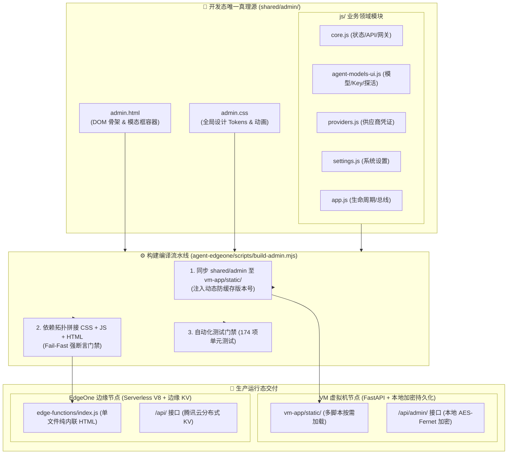

# OCRProxy 单真理源 UI 架构设计规范书 (UI Single-Source Architecture Design)

## 📌 架构背景与目标

在历史版本迭代中，OCRProxy 曾分别在 `vm-app/static/` 和 `agent-edgeone/` 中各自维护了一套前端代码，导致出现严重的维护割裂与研发低效：
1. **修改一个小功能需要查半天代码**：不知该在 VM 改还是在 EdgeOne 改，反复检索、多次对比、耗时耗力；
2. **两端体验与样式不一致**：EdgeOne 优化了首页卡片或加了新特性，VM 依然停留在老版本；
3. **打包时序与兼容性缺陷**：单文件打包时脚本拼接顺序不当引发 ES6 TDZ（暂存死区）运行时崩溃，或 CSS 动画类漏打包导致按钮视觉消失。

为彻底根治上述问题，从 `v2026.10.09-06` 起，全面确立 **UI 单一真理源架构 (Single Source of Truth, SSOT)**：
- **开发态唯一源头**：所有前端 HTML 结构、CSS 样式与 JS 交互逻辑全部收敛至 [`shared/admin/`](file:///Users/xk/Documents/ocrprox/shared/admin/)；
- **构建态自动化流水线**：由 `build-admin.mjs` 统一编译、内联与下发，两端永远保持 100% 同步；
- **运行态环境自适应**：一套前端代码，在浏览器端自适应识别 VM（多模式与本地持久化）与 EdgeOne（纯 Agent 与 KV 中枢）两大宿主环境，保障两端各自的稳定性。

---

## 🏛️ 系统分层与构建流拓扑



---

## 📁 模块职责与改动索引速查表 (Developer Cheat Sheet)

> [!IMPORTANT]
> **开发铁律**：后续任何界面改动、文案微调或样式修复，**直接根据下表定位对应文件，严禁全工程到处全局搜索**！

| 业务领域与需求场景 | 唯一定位文件 | 核心函数 / DOM 节点 | 职责与规范说明 |
| :--- | :--- | :--- | :--- |
| **顶部品牌、导航栏、全局弹窗容器** | [`shared/admin/admin.html`](file:///Users/xk/Documents/ocrprox/shared/admin/admin.html) | `#topNav`, `#topVersionBadge`, `#topModeBadge`, `#modalContainer` | 定义页面纯 HTML 语义骨架；所有弹窗默认内联 `style="display:none;"` |
| **首页三行网关卡片** | [`shared/admin/admin.html`](file:///Users/xk/Documents/ocrprox/shared/admin/admin.html) | `#db-access-section`, `.gateway-card`, `#dbBaseUrl`, `#gwClientKeyVal`, `#listAvailableModels` | 规范化三行展示：Base URL + Client Key + 可用模型胶囊 |
| **按钮、动画、颜色、卡片样式** | [`shared/admin/admin.css`](file:///Users/xk/Documents/ocrprox/shared/admin/admin.css) | `.btn-xs`, `.spinner`, `@keyframes spin`, `.gateway-card`, `.model-chip-clickable` | 全局样式真理源；任何微动画（如探活旋转）必须在此声明 |
| **全局状态、API 封装、网关卡片渲染** | [`shared/admin/js/core.js`](file:///Users/xk/Documents/ocrprox/shared/admin/js/core.js) | `state`, `renderDashboardGateway()`, `copyText()`, `copyModelName()`, `copyAllAvailableModels()`, `manageAllModels()` | 维护全局配置状态；提供安全复制助手；渲染首页三行网关卡片 |
| **Agent 模型卡片、Key 胶囊、探活** | [`shared/admin/js/agent-models-ui.js`](file:///Users/xk/Documents/ocrprox/shared/admin/js/agent-models-ui.js) | `renderAgentModels()`, `renderAgentBindingRow()`, `testAgentKey()`, `testAgentModelAll()`, `openAgentModal()` | Agent 模型管理核心组件；Key 胶囊管理；连通性探测（包含 `finally` 复原兜底） |
| **供应商与 Key 凭证库、中枢规则同步** | [`shared/admin/js/providers.js`](file:///Users/xk/Documents/ocrprox/shared/admin/js/providers.js) | `renderProviders()`, `syncFromEdgeOneVault()`, `openProviderModal()` | 供应商独立管理视图（支持 A-Z 字母轨导航）；与 EdgeOne 凭据中枢交互 |
| **系统设置面板、超时与多模式切换** | [`shared/admin/js/settings.js`](file:///Users/xk/Documents/ocrprox/shared/admin/js/settings.js) | `renderSettings()`, `saveSettings()`, `switchRunMode()` | 系统参数调优（超时、重试、熔断）；模式切换（Agent / KB） |
| **应用生命周期、事件总线分发** | [`shared/admin/js/app.js`](file:///Users/xk/Documents/ocrprox/shared/admin/js/app.js) | `DOMContentLoaded`, `initAgentModelsDelegation()` | 应用入口点；在 DOM 树加载完毕后统一分发事件委托，杜绝竞态加载 |

---

## ⚡ 核心设计细节与防坑规范

### 1. 消除 TDZ（暂存死区）与脚本拼接规范
- **根因剖析**：EdgeOne 打包时将 `agent-models-ui.js` 拼在 `admin.js` 前面。若后面的脚本使用 ES6 `let` 声明变量（如 `let modelLatencyCache = {}`），而前面的脚本在声明前访问该变量，即便使用 `typeof` 也会触发 **TDZ 暂存死区崩溃**（`ReferenceError: Cannot access '...' before initialization`）。
- **设计规范**：
  1. 所有跨文件共享的全局状态或缓存，必须明确挂载到 `window` 全局对象（例如：`window.modelLatencyCache = window.modelLatencyCache || {}`）；
  2. 声明提升安全防护：全局变量声明必须使用 `var xxx = window.xxx = window.xxx || {}`，杜绝 `let` 引起的 TDZ。

### 2. 按钮状态自愈防丢失设计
- **根因剖析**：点击按钮发起异步操作时，通常将 `innerHTML` 替换为 `<span class="spinner"></span>` 并设置 `disabled = true`。如果后续接口抛错（如 401、404、500、网络超时或代码未捕获异常），重置逻辑未被执行，会导致按钮永久停留在加载态或空白态。
- **设计规范**：
  任何操作按钮的异步动作必须采用标准 `try ... catch ... finally` 闭环。在 `finally` 块中必须包含无条件兜底重置：
  ```javascript
  try {
    // 异步执行
  } catch (err) {
    _toast('执行失败: ' + err.message, 'err');
  } finally {
    // 强制兜底复原，杜绝任何情况下按钮消失
    if (btn) {
      btn.disabled = false;
      btn.innerHTML = '测'; // 恢复原始文案
    }
    // 触发安全重绘刷新
    await safeReload();
  }
  ```

### 3. 宿主环境自适应隔离设计 (`isVm` 探针)
为了让同一套 UI 代码安全运行在不同架构上，公共组件内部通过环境探针精确识别宿主类型，实现接口自动分流：
```javascript
function getCtx() {
  const isVm = (typeof state !== 'undefined' && state.config);
  return {
    isVm,
    cfg: isVm ? state.config : (typeof cfg !== 'undefined' ? cfg : {}),
    stats: isVm ? state.stats : (typeof healthData !== 'undefined' ? healthData : {})
  };
}
```
- **在 VM 宿主下**：探活请求路由至 `/api/admin/test-candidate`，保存配置路由至 `/api/admin/config`，数据持久化至本地加密文件；
- **在 EdgeOne 宿主下**：探活请求路由至 `/api/test`，保存配置路由至 `/api/config`，数据持久化至边缘 KV。

---

## 🛠️ 标准开发与打包发布流程

任何针对前端界面的修改，必须严格按照以下三步执行，严禁跳步：

### 第一步：在 `shared/admin/` 中完成修改
- 修改样式：编辑 `shared/admin/admin.css`
- 修改卡片/布局：编辑 `shared/admin/admin.html`
- 修改业务逻辑：编辑 `shared/admin/js/` 对应文件

### 第二步：执行单命令全自动构建
```bash
node agent-edgeone/scripts/build-admin.mjs
```
该命令会自动触发三项操作：
1. **同步并注入版本号**：将最新代码同步至 `vm-app/static/`，并读取 `version.json` 自动更新 script 标签版本；
2. **生成单文件边缘函数**：深度内联 CSS 与 JS，写入 `edge-functions/index.js` 和 `edge-functions/admin.js`；
3. **Fail-Fast 编译强断言**：自动检查是否残留未内联标签、核心函数是否存在，若有缺陷立即中断退出。

### 第三步：运行全量自动化测试矩阵
```bash
node agent-edgeone/scripts/test-units.mjs && python3 tests/test_secret_preservation.py && python3 tests/test_phase3_phase4_audit.py
```
- 必须保证 174 项 EdgeOne 测试 100% PASS；
- 必须保证凭据反脱敏测试 100% PASS；
- 必须保证架构审计与发版测试 100% PASS。
